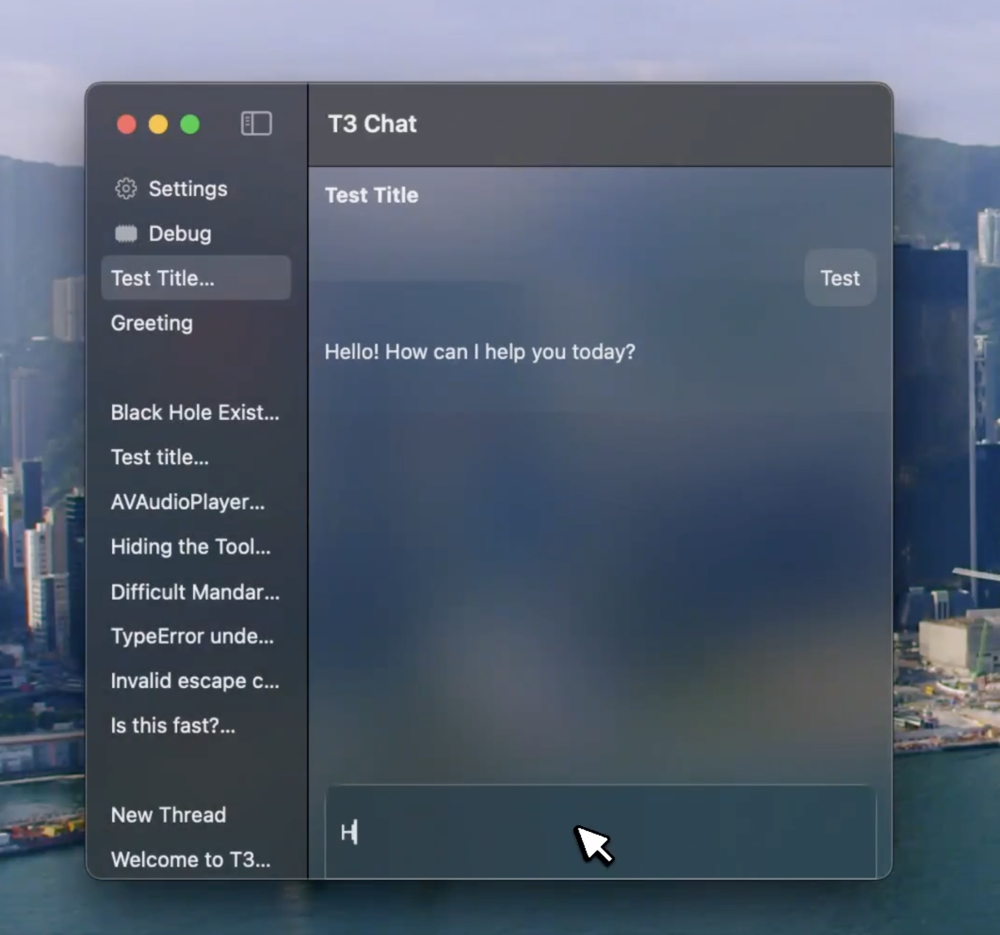

# T3 Chat Mac App

## [BROKEN because of T3 Chat's API changes]

An unofficial client for [T3 Chat](https://t3.chat) for Mac that worked on T3 Chat's old API (1st May 2025)

To make it work again some major changes are needed from the data retrieval and sending part.
The current version relies on web sockets to retrieve data and send messages so it's not possible to use the current approach.

[Demo of it in action](https://x.com/dcrebbin_/status/1921834319917863110/video/1)

## ISSUES:

- [ ] Remove all references to the project skeleton: [OpenAI Voice Mode Chat](https://github.com/dcrebbin/oai-voice-mode-chat-mac)
- [ ] Clean up the codebase: abstract the codebase into smaller files and functions and proper typing/interface definitions
- [ ] Fix the data retrieval and sending part
- [ ] UI updates based on any new data model changes
- [ ] Come up with a better approach of displaying code (which was the previous main issue)
